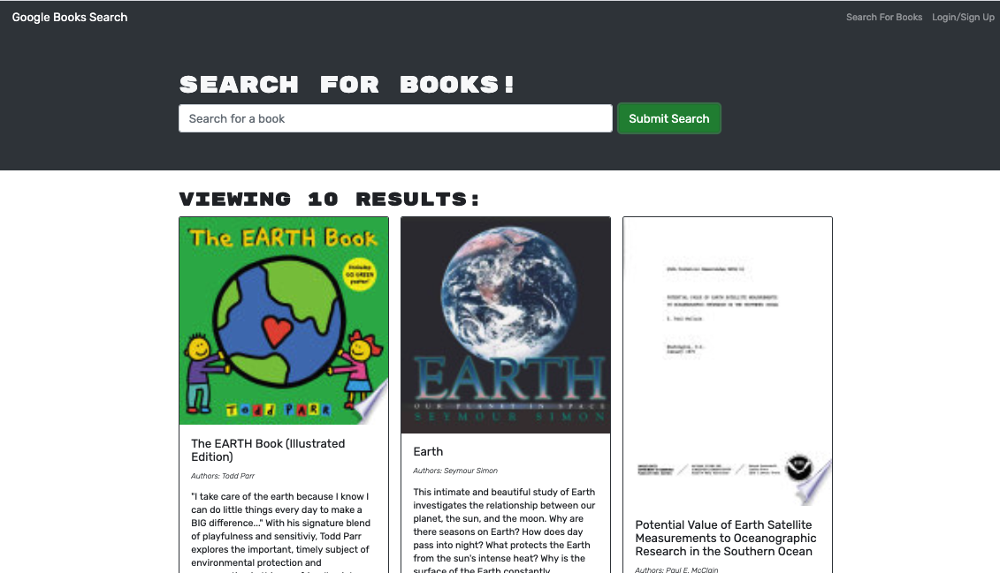

# Book Search Engine

### Description :page_with_curl:

This code features a fully functioning Google Books API search engine refactored with GraphQL API built with Apollo Server. The app is built using the MERN stack, with a React front end, MongoDB database, and Node.js/Express.js server and API.

The project is deployed to [Heroku.](https://pacific-lake-24075.herokuapp.com/)

#### Screenshots :camera_flash:

#### Technology Used :label: 

* MERN
#### Resources Used :wrench: 

* [react documentation](https://reactjs.org/)
* [deployment](https://facebook.github.io/create-react-app/docs/deployment) 
* [heroku](https://devcenter.heroku.com/articles/logging#view-logs)
* [Apollo Server](https://www.apollographql.com/docs/apollo-server/)
* [graphql](https://graphql.org/)
* [emoji-readme](https://github.com/ikatyang/emoji-cheat-sheet)
#### Installation :electric_plug:

* Install the following dependencies in server:
`npm i apollo-server-express`,`npm install jsonwebtoken`.To start
`npm run watch`.

* Client dependencies:
`npm i apollo-boost graphql graphql-tag @apollo/react-hooks`, `npm install react-router-dom`,
`npm install jwt-decode`.

* Root directory dependencies:
`npm init`,
`npm install if-env`, `npm install -D concurrently`. Run `npm start` at the root of the directory to connect to the server.

#### Contribution :heavy_plus_sign: 

Contributions, issues and feature requests are welcome. 
Check out [issues page](https://github.com/MarynaPR/book-search/issues). 
Give :star: if you found this project useful. 

#### Questions :question: 
Feel free to contact me with any questions via email: [:e-mail:](pryadkamaryna@gmail.com).
If you'd like to see my other projects, please visit my :octocat: 
[GitHub.](https://github.com/MarynaPR?tab=repositories)

